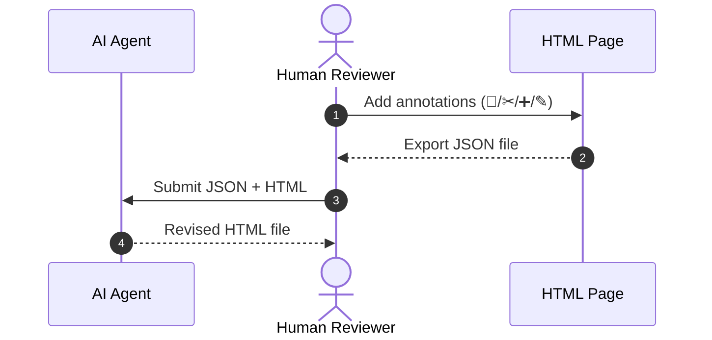

# html-template-pack

[](https://opensource.org/licenses/MIT)
[](https://cheahhl814.github.io/html-template-pack/)
[](#-installation)

Four self-contained HTML templates — **report** (sticky sidebar, 5 icon+label tabs, v2 offset-anchored annotations, theme toggle), **slide deck** (prev/next nav, inline v2 annotations, theme toggle), **bento brief** (2026 bento-grid one-page snapshot briefing, dark-first glass, full v2 annotation engine), and **htmx dashboard** (topbar, KPI row, sparkline chart, activity feed, sortable table, demo-mode mock backend). All four ship the **v0.8.0 zero-dependency graphics pack** (donut, radial gauge, horizontal bars, heatmap, data-bar cells, pure-CSS flowchart, milestone strip, comparison table, pull-quote, scroll-driven motion) and are single-file, review-ready HTML with no external CDN dependencies beyond Google Fonts (report/slide/bento) and pinned htmx with SRI (dashboard). All four are **dark-first** with refined glass chrome, fluid display typography, and hover-glow micro-interactions (v0.7.0 aesthetic pass).

**Repository**: https://github.com/cheahhl814/html-template-pack

## Contents

- [Live demo](#-live-demo)
- [Installation](#-installation)
- [Usage examples](#-usage-examples)
- [What this skill does](#-what-this-skill-does)
- [Annotation system](#-annotation-system-report--slide)
- [Theme toggle](#-theme-toggle)
- [Density and font-size toggles](#-density-and-font-size-toggles-all-three-templates)
- [Graphics pack](#-graphics-pack-v080)
- [Hard invariants](#-hard-invariants)

## 🚀 Live demo

All four templates are deployed as a working demo on GitHub Pages. Open any of them to interact with the live UI — no setup, no build step, no backend.

| | |
|---|---|
| 🌐 **Launcher** | https://cheahhl814.github.io/html-template-pack/ |
| 📄 **[Report demo](https://cheahhl814.github.io/html-template-pack/report/)** | "Q3 Operations Review — Northwind Logistics" (5 tabs, custom content) |
| 🎞️ **[Slide demo](https://cheahhl814.github.io/html-template-pack/slide/)** | "Helios 2 — Real-Time Inference for the Edge" (7 slides incl. graphics-pack demos) |
| 🍱 **[Bento demo](https://cheahhl814.github.io/html-template-pack/bento/)** | "Project Phoenix — One-page Recap" (bento grid, full annotation engine) |
| 🧩 **[Components demo](https://cheahhl814.github.io/html-template-pack/components/)** | The graphics pack in one page — donut, gauge, bars, heatmap, flow, compare, pull-quote, motion legend |
| 📊 **[Dashboard demo](https://cheahhl814.github.io/html-template-pack/dashboard/)** | "Northwind Logistics — Operations Dashboard" (mock data, live polling) |

Each demo is a curated showcase with realistic content (not a blank template). Try the **◐ theme toggle**, **▤ density toggle**, **S/M/L font size toggle** in the top-right of every demo. In the report, slide, and bento demos, select any text to leave tracked-changes-style annotations, then export them as JSON from the 💬 Notes panel.

**Source files** (for starting your own document): see [`templates/`](./templates/) and follow the usage examples below.

## 🛠️ Installation

This is an **agent skill**, not a user-facing library. The skill is loaded by the agent harness at startup.

**To install, give your AI agent this prompt:**

```
Import the following skill: https://github.com/cheahhl814/html-template-pack
```

Once installed, the skill is **auto-invoked**: when you ask the agent for an HTML report, slide deck, or dashboard, the agent routes the request here automatically. No manual `cp` needed — the agent copies the appropriate template, fills in the content, and hands you a ready-to-review `.html` file.

## 💡 Usage examples

### Slash commands and explicit invocation

Different agent harnesses use different mechanisms to force-load a skill. Use whichever matches your setup:

| Harness | Force-load command | Notes |
|---------|-------------------|-------|
| **Pi** | `/skill:html-template-pack` | Slash command; works even when auto-detection misses |
| **Claude Code** | `/html-template-pack <request>` | Slash command (Claude Code uses `/name` for skills and plugins) |
| **OpenCode** | Mention `"Use the html-template-pack skill"` in your prompt | OpenCode reads skill metadata from `SKILL.md` at startup |
| **Codex** | Mention the skill by name in your prompt | Codex reads skill metadata from `SKILL.md` at startup |

In all cases, the harness needs to discover the skill first — typically by cloning the repo into the harness's skills directory (`~/.pi/agent/skills/`, `~/.claude/skills/`, etc.) or by registering it via the harness's skill configuration.

If auto-detection works, you can just use natural language prompts — the harness routes them automatically. Slash commands / explicit mentions are useful when:

- The request is ambiguous and you want full control over the workflow
- The harness picked the wrong skill (e.g. chose `lumen-guide` instead of `html-template-pack`)
- You want to chain skills explicitly (e.g. invoke this one after `notebooklm-jacob` to wrap its output)

### Natural language prompts that trigger the skill

These phrases auto-invoke the skill via the global `AGENTS.md` decision matrix:

<details>
<summary><b>Report</b> (≥3 long sections, prose, charts, references)</summary>

```
Build me an HTML report from path/to/source.md.
Convert this Markdown into a reviewable HTML page.
Make a reading version of my manuscript for the team to comment on.
I need a single-file HTML the team can annotate.
Generate the grant submission recap as HTML.
```
</details>

<details>
<summary><b>Slide deck</b> (≤12 visual beats, bullets, one idea per slide)</summary>

```
Create a slide deck about X.
Convert this DOCX / PDF into a deck.
Make a pitch deck from this outline.
Build a 5-slide internal readout on the latest experiment results.
```
</details>

<details>
<summary><b>Dashboard</b> (live data, KPIs, ops metrics)</summary>

```
Build me a dashboard for tracking X.
Set up an ops dashboard with these KPIs.
Create an admin panel showing the live state of the system.
Wire up an htmx dashboard against /api/stats, /api/activity, etc.
```
</details>

### Multi-step review workflow

A complete review cycle uses three skills together:

1. **Generate**: "Build an HTML report from `path/to/draft.md`."
   - Agent auto-invokes `html-template-pack` → produces `report.html`
2. **Review**: Open the HTML in a browser, leave annotations (select text, click 💬 / ✂ / ➕ / ✎ in the floating toolbar, or use the Notes panel for editing). When done, click **💾 Export** in the Notes panel to download `annotations-<id>.json`.
3. **Revise**: "Apply the annotations from `annotations-report-template.json` to `report.html`."
   - Agent reads the JSON, applies each annotation, and produces a revised `report.html`

The exported JSON is the bridge between human reviewers and the AI — it's the only artifact that crosses the human→AI boundary in this workflow.

### Force-routing (when the wrong template gets picked)

If the agent picks the wrong template, you can be explicit:

```
Use the slide template, not the report template.
That's a dashboard, not a report.
Don't use the report template here — the content has 8 discrete bullets, use the slide deck.
```

Or steer away from this skill entirely:

```
Don't build a full HTML report — just give me a Markdown summary.
Skip the HTML, write a plain text outline instead.
```

## 🎯 What this skill does

The skill ships four HTML templates. Pick the one that matches your content.

### Report template

A long-form reading document with a sticky left sidebar of tabs. The reviewer clicks between tabs to read different sections (Summary, Metrics, Methodology, Findings, Annotations), selects text to leave tracked-changes-style notes, and exports the notes as a JSON file when finished. The sidebar collapses to a horizontal tab strip on narrow screens. When printed, the sidebar hides and all sections flow sequentially with page breaks.

**Best for**: research reports, grant progress reports, manuscript reading versions, gap analyses, EOI drafts — anything a human will read end-to-end and leave comments on.

### Slide template

A single-page scrolling deck with prev/next navigation, a page counter, a fullscreen toggle, and a home button. Each slide is a section with v2 annotations (notes you can leave on any text) and a per-slide identifier so a notes drawer click jumps directly to that slide. When printed, each slide becomes one PDF page.

**Best for**: pitch decks, conference talks, lightning talks, internal readouts, research summary decks — any sequential presentation of 12 or fewer visual beats.

### Dashboard template

A fixed-topbar shell with a sidebar navigation and a content area laid out as a grid: a row of KPI stat cards, a sparkline chart panel, a recent-activity feed, and a sortable/filterable/searchable data table. The interactions are wired with htmx — the table polls every few seconds, search is debounced, and sort state carries across requests. The four data endpoints (`/api/stats`, `/api/chart`, `/api/activity`, `/api/table`) are expected to return HTML fragments, not JSON.

The template ships in **demo mode** out of the box: a small mock backend intercepts every request to `/api/*` and answers from an embedded dataset, so the file opens in a browser and is fully interactive (filter, sort, poll, pause/resume) before any real backend exists. Once you have a real server, delete the `data-demo-mode` attribute on the body and the `« BEGIN/END DEMO MODE »` script block at the end of the file. Nothing else in the markup changes.

**Best for**: ops dashboards, admin panels, status pages, internal metrics views — anything meant to be watched and interacted with live, not read and annotated.

### Bento brief template (NEW in v0.7.0)

A one-page snapshot briefing in the 2026 bento-grid style: a hero header (eyebrow pill, gradient display title, meta chips) above a 12-column grid of modular glass cards — KPI row, pure-CSS bar chart, progress bars, gradient quote card, milestone timeline, key highlights, and a CTA card. Dark-first glass surfaces with an ambient accent glow; cards lift with an accent-glow shadow on hover. It carries the full v2 annotation engine (select any text to leave tracked-changes-style notes, export/import JSON), plus the theme, density, and font-size toggles with bento-specific storage keys. No JS dependencies at all — the chart is pure CSS.

**Best for**: sprint recaps, weekly readouts, one-page proposals, status snapshots for review panels — anything the reader should grasp in 60 seconds and annotate inline. If the content grows past one page, graduate to the report template; if the numbers need to refresh from a server, it's the dashboard.

## 💬 Annotation system (report, slide + bento)

> **Audience: human reviewers.** The other sections of this README document what
> the agent/harness should do. This section is for the *human* who opens the
> rendered HTML in a browser and wants to leave review notes. The agent does
> not interact with the annotation UI directly.

When you open a report or slide in a browser, you can leave tracked-changes-style notes directly on the text. Select any passage, choose what kind of note you want to leave, and a small floating toolbar appears with options. Your notes are saved in your browser automatically and can be exported as a file to send to an AI coding agent for revision.

### The review cycle



### Advanced note management

- **Import**: Use **⬆ Import** to merge JSON files from other reviewers.
- **Orphans**: If the document text changes, some notes may no longer point to the exact text. These appear with a **red border and warning** in the Notes panel.
- **Storage**: Notes live in `localStorage` under `annotations:<id>`. For a multi-document project, give each one a unique id (e.g., `<body data-annot-storage="my-report-2026">`) so reviews don't overwrite each other.

### Feature reference

For quick reference, here's the full feature matrix across the two templates:

| Feature | Report | Slide |
|---------|:------:|:-----:|
| Select text → floating toolbar (4 options) | ✅ | ✅ |
| Right-side Notes panel with all notes | ✅ | ✅ |
| Click a note to jump back to its text | ✅ | ✅ |
| Edit or delete a note | ✅ | ✅ |
| Export to JSON file | ✅ | ✅ |
| Export to clipboard | ✅ | ✅ |
| Import JSON (merge by id) | ✅ | ✅ |
| Flag orphaned notes (text shifted) | ✅ | ✅ |
| Auto-switch to the right tab/slide on jump | ✅ | ✅ |
| Notes survive Mermaid diagram re-renders | ✅ | ✅ |

## 🎨 Theme toggle

All three templates have a **◐ dark / ◑ light** button at the top-right (dashboard has it inline in the topbar). Click it to switch between light and dark themes. The choice is remembered in your browser and follows your operating system's dark-mode preference on first visit. The theme toggle is hidden when you print the document.

## ⚡ Density and font-size toggles (all four templates)

Two extra buttons appear next to the theme toggle. They help reviewers read dense content more comfortably.

<table>
<tr><th>Toggle</th><th>States</th><th>Storage key</th><th>Affects</th></tr>
<tr>
  <td><b>Density</b> (<code>▤</code> / <code>▥</code>)</td>
  <td>comfortable (default) → compact</td>
  <td><code>report-density</code>, <code>slide-density</code>, <code>dashboard-density</code></td>
  <td>Card padding, table cell padding, stat-card padding, grid gaps, panel top spacing</td>
</tr>
<tr>
  <td><b>Font size</b> (<code>S</code> / <code>M</code> / <code>L</code>)</td>
  <td>Small (14px) → Medium (16px, default) → Large (18px)</td>
  <td><code>report-font-size</code>, <code>slide-font-size</code>, <code>dashboard-font-size</code></td>
  <td>Every text element using proportional units</td>
</tr>
</table>

Both toggles:

- Persist in your browser independently of the theme
- Reset to defaults when you print (so PDF output looks consistent)
- Apply to whichever template you're viewing

The **dashboard** template's toggles are especially useful when viewing dense data tables — switch to compact + small to fit more rows on screen, or comfortable + large for a presentation-style view.

**Why these toggles work**: every element in each template uses proportional units (`rem` or `em`) relative to the root font size. Changing the root font size cascades through every element. The slide template had a bug where `body { font-size: 16px }` blocked this cascade; that's been fixed so all three templates behave the same way.

## 🧩 Graphics pack (v0.8.0)

All four templates ship with a shared **zero-dependency graphics pack** — eleven components, pure CSS/HTML, no JS, no chart library, no canvas. Lives in [`features/graphics/graphics.css`](./features/graphics/graphics.css) (inlined into each template) with a copy-paste reference at [`features/graphics/snippets.html`](./features/graphics/snippets.html).

| | Component | Class |
|---|---|---|
| 📊 | **Donut / pie chart** | `.donut` + `.legend` |
| 🎯 | **Radial gauge** | `.gauge` (variants `.g-green .g-amber .g-coral`) |
| 📶 | **Horizontal bars** | `.hbar` (colours `.c-teal .c-amber .c-coral .c-green`) |
| 🟦 | **Heatmap table** | `.heat` on a real `<table>` with `td[data-level="0-4"]` |
| 🟫 | **Data bars in cells** | `.db-cell` + `.db-bar` |
| 🔀 | **Pure-CSS flowchart** | `.flow` + `.flow-node` (.start .end .decision) + `.flow-branch` |
| 🚩 | **Milestone strip** | `.mstrip` |
| ⊞ | **Comparison table** | `.compare` (`.rec-col`, ✓/— via `.yes`/`.no`) |
| ❝ | **Pull-quote** | `.pull-quote` |
| ▰ | **Reading progress bar** | `<div class="reading-progress">` |
| ⤓ | **Scroll-driven reveal** | `.reveal` |
| ⌖ | **Gauge sweep** | `.gauge.animated` |

**Live reference**: see every component at **[…/components/](https://cheahhl814.github.io/html-template-pack/components/)** — the same file also inlines a *motion legend* (browser-state matrix + 4-keyframe progress strip + before/after reveal pair + 5-step gauge sweep) so pack D is obvious from a single screenshot.

**Accessibility baked in**: every visual chart is built from a real `<table>` (heatmap, data bars) or paired with a visually-hidden `<table>` fallback (donut); `role="img"` + `aria-label` on conic charts; numbers stay visible in heatmap cells; motion is `@supports (animation-timeline: …)` + `prefers-reduced-motion` guarded — browsers without support just see the final state, no JS fallback needed.

## 🔒 Hard invariants

- UI always reachable (theme, annotations, navigation)
- Annotations persist across reloads (valid JSON or fresh start)
- Print works cleanly (report/slide primary; dashboard secondary)
- Single-file portable (only Google Fonts + pinned htmx SRI allowed external)
- Dashboard demo-mode never ships to production
- Graphics pack ships with no JS dependencies (conic-gradient + CSS grid only)

## License

MIT — see the `license` field in [`SKILL.md`](./SKILL.md).
