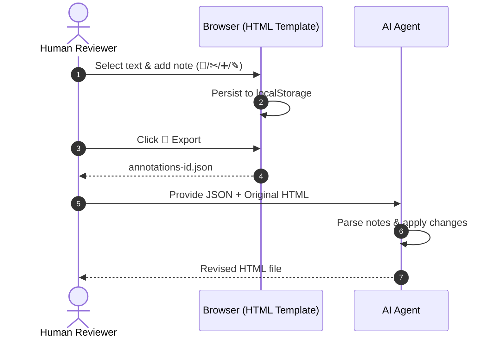

# html-template-pack

Three self-contained HTML templates — **report** (left-side sticky sidebar with 5 icon+label tabs, v2 offset-anchored annotations, theme toggle), **slide deck** (prev/next nav, inline v2 annotations, theme toggle), and **htmx dashboard** (topbar, KPI row, sparkline chart, activity feed, sortable table, demo-mode mock backend). All three are single-file, review-ready HTML with no external CDN dependencies beyond Google Fonts (report/slide) and pinned htmx with SRI (dashboard).

> **Repository**: https://github.com/cheahhl814/html-template-pack

## 🚀 Live demo

All three templates are deployed as a working demo on GitHub Pages. Open any of them to interact with the live UI — no setup, no build step, no backend.

- 🌐 **Launcher**: https://cheahhl814.github.io/html-template-pack/
- 📄 **[Report demo](https://cheahhl814.github.io/html-template-pack/report/)** — "Q3 Operations Review — Northwind Logistics" (5 tabs, custom content)
- 🎞️ **[Slide demo](https://cheahhl814.github.io/html-template-pack/slide/)** — "Helios 2 — Real-Time Inference for the Edge" (5 slides, product launch)
- 📊 **[Dashboard demo](https://cheahhl814.github.io/html-template-pack/dashboard/)** — "Northwind Logistics — Operations Dashboard" (mock data, live polling)

Each demo is a curated showcase with realistic content (not a blank template). Try the **◐ theme toggle**, **▤ density toggle**, **S/M/L font size toggle** in the top-right of every demo. In the report and slide demos, select any text to leave tracked-changes-style annotations, then export them as JSON from the 💬 Notes panel.

**Source files** (for starting your own document): see [`templates/`](./templates/) and follow the usage examples below.

## 🛠️ Installation

This is an **agent skill**, not a user-facing library. The skill is loaded by the agent harness at startup.

**To install, give your AI agent this prompt:**

```
Import the following skill: https://github.com/cheahhl814/html-template-pack
```

Once installed, the skill is **auto-invoked**: when you ask the agent for an HTML report, slide deck, or dashboard, the agent routes the request here automatically. No manual `cp` needed — the agent copies the appropriate template, fills in the content, and hands you a ready-to-review `.html` file.

## 💡 Usage examples

### Slash commands and explicit invocation

Different agent harnesses use different mechanisms to force-load a skill. Use whichever matches your setup:

| Harness | Force-load command | Notes |
|---------|-------------------|-------|
| **Pi** | `/skill:html-template-pack` | Slash command; works even when auto-detection misses |
| **Claude Code** | `/html-template-pack <request>` | Slash command (Claude Code uses `/name` for skills and plugins) |
| **OpenCode** | Mention `"Use the html-template-pack skill"` in your prompt | OpenCode reads skill metadata from `SKILL.md` at startup |
| **Codex** | Mention the skill by name in your prompt | Codex reads skill metadata from `SKILL.md` at startup |

In all cases, the harness needs to discover the skill first — typically by cloning the repo into the harness's skills directory (`~/.pi/agent/skills/`, `~/.claude/skills/`, etc.) or by registering it via the harness's skill configuration.

If auto-detection works, you can just use natural language prompts — the harness routes them automatically. Slash commands / explicit mentions are useful when:

- The request is ambiguous and you want full control over the workflow
- The harness picked the wrong skill (e.g. chose `lumen-guide` instead of `html-template-pack`)
- You want to chain skills explicitly (e.g. invoke this one after `notebooklm-jacob` to wrap its output)

### Natural language prompts that trigger the skill

These phrases auto-invoke the skill via the global `AGENTS.md` decision matrix:

**Report** (≥3 long sections, prose, charts, references):

```
Build me an HTML report from path/to/source.md.
Convert this Markdown into a reviewable HTML page.
Make a reading version of my manuscript for the team to comment on.
I need a single-file HTML the team can annotate.
Generate the grant submission recap as HTML.
```

**Slide deck** (≤12 visual beats, bullets, one idea per slide):

```
Create a slide deck about X.
Convert this DOCX / PDF into a deck.
Make a pitch deck from this outline.
Build a 5-slide internal readout on the latest experiment results.
```

**Dashboard** (live data, KPIs, ops metrics):

```
Build me a dashboard for tracking X.
Set up an ops dashboard with these KPIs.
Create an admin panel showing the live state of the system.
Wire up an htmx dashboard against /api/stats, /api/activity, etc.
```

### Multi-step review workflow

A complete review cycle uses three skills together:

1. **Generate**: "Build an HTML report from `path/to/draft.md`."
   - Agent auto-invokes `html-template-pack` → produces `report.html`
2. **Review**: Open the HTML in a browser, leave annotations (select text, click 💬 / ✂ / ➕ / ✎ in the floating toolbar, or use the Notes panel for editing). When done, click **💾 Export** in the Notes panel to download `annotations-<id>.json`.
3. **Revise**: "Apply the annotations from `annotations-report-template.json` to `report.html`."
   - Agent reads the JSON, applies each annotation, and produces a revised `report.html`

The exported JSON is the bridge between human reviewers and the AI — it's the only artifact that crosses the human→AI boundary in this workflow.

### Force-routing (when the wrong template gets picked)

If the agent picks the wrong template, you can be explicit:

```
Use the slide template, not the report template.
That's a dashboard, not a report.
Don't use the report template here — the content has 8 discrete bullets, use the slide deck.
```

Or steer away from this skill entirely:

```
Don't build a full HTML report — just give me a Markdown summary.
Skip the HTML, write a plain text outline instead.
```

## 🎯 What this skill does

The skill ships three HTML templates. Pick the one that matches your content.

### Report template

A long-form reading document with a sticky left sidebar of tabs. The reviewer clicks between tabs to read different sections (Summary, Metrics, Methodology, Findings, Annotations), selects text to leave tracked-changes-style notes, and exports the notes as a JSON file when finished. The sidebar collapses to a horizontal tab strip on narrow screens. When printed, the sidebar hides and all sections flow sequentially with page breaks.

**Best for**: research reports, grant progress reports, manuscript reading versions, gap analyses, EOI drafts — anything a human will read end-to-end and leave comments on.

### Slide template

A single-page scrolling deck with prev/next navigation, slide dots, a counter, a fullscreen toggle, and a home button. Each slide is a section with v2 annotations (notes you can leave on any text) and a per-slide identifier so a notes drawer click jumps directly to that slide. When printed, each slide becomes one PDF page.

**Best for**: pitch decks, conference talks, lightning talks, internal readouts, research summary decks — any sequential presentation of 12 or fewer visual beats.

### Dashboard template

A fixed-topbar shell with a sidebar navigation and a content area laid out as a grid: a row of KPI stat cards, a sparkline chart panel, a recent-activity feed, and a sortable/filterable/searchable data table. The interactions are wired with htmx — the table polls every few seconds, search is debounced, and sort state carries across requests. The four data endpoints (`/api/stats`, `/api/chart`, `/api/activity`, `/api/table`) are expected to return HTML fragments, not JSON.

The template ships in **demo mode** out of the box: a small mock backend intercepts every request to `/api/*` and answers from an embedded dataset, so the file opens in a browser and is fully interactive (filter, sort, poll, pause/resume) before any real backend exists. Once you have a real server, delete the `data-demo-mode` attribute on the body and the `« BEGIN/END DEMO MODE »` script block at the end of the file. Nothing else in the markup changes.

**Best for**: ops dashboards, admin panels, status pages, internal metrics views — anything meant to be watched and interacted with live, not read and annotated.

## 💬 Annotation system (report + slide)

> **Audience: human reviewers.** The other sections of this README document what
> the agent/harness should do. This section is for the *human* who opens the
> rendered HTML in a browser and wants to leave review notes. The agent does
> not interact with the annotation UI directly.

When you open a report or slide in a browser, you can leave tracked-changes-style notes directly on the text. Select any passage, choose what kind of note you want to leave, and a small floating toolbar appears with options. Your notes are saved in your browser automatically and can be exported as a file to send to an AI coding agent for revision.

### The Review Cycle



### Advanced Note Management

- **Import**: Use **⬆ Import** to merge JSON files from other reviewers.
- **Orphans**: If the document text changes, some notes may no longer point to the exact text. These appear with a **red border and warning** in the Notes panel.
- **Storage**: Notes live in `localStorage` under `annotations:<id>`. For a multi-document project, give each one a unique id (e.g., `<body data-annot-storage="my-report-2026">`) so reviews don't overwrite each other.


### Feature reference

For quick reference, here's the full feature matrix across the two templates:

| Feature | Report | Slide |
|---------|--------|-------|
| Select text → floating toolbar (4 options) | ✓ | ✓ |
| Right-side Notes panel with all notes | ✓ | ✓ |
| Click a note to jump back to its text | ✓ | ✓ |
| Edit or delete a note | ✓ | ✓ |
| Export to JSON file | ✓ | ✓ |
| Export to clipboard | ✓ | ✓ |
| Import JSON (merge by id) | ✓ | ✓ |
| Flag orphaned notes (text shifted) | ✓ | ✓ |
| Auto-switch to the right tab/slide on jump | ✓ | ✓ |
| Notes survive Mermaid diagram re-renders | ✓ | ✓ |

## 🎨 Theme toggle

All three templates have a **◐ dark / ◑ light** button at the top-right (dashboard has it inline in the topbar). Click it to switch between light and dark themes. The choice is remembered in your browser and follows your operating system's dark-mode preference on first visit. The theme toggle is hidden when you print the document.

## ⚡ Density and font-size toggles (all three templates)

Two extra buttons appear next to the theme toggle. They help reviewers read dense content more comfortably:

### Density toggle (`▤` / `▥`)

Switches between **comfortable** (default) and **compact** spacing. Useful when a report has lots of data tables or dense cards — compact mode shrinks the padding so you can fit more on screen.

- Storage key: `report-density`, `slide-density`, or `dashboard-density` (one per template)
- Affects: card padding, table cell padding, stat-card padding, grid gaps, panel top spacing

### Font size toggle (`S` / `M` / `L`)

Cycles between **Small** (14px), **Medium** (16px, default), and **Large** (18px). Changes the base font size, which scales every proportional text size in the document.

- Storage key: `report-font-size`, `slide-font-size`, or `dashboard-font-size` (one per template)
- Affects: every text element that uses proportional units

Both toggles:

- Persist in your browser independently of the theme
- Reset to defaults when you print (so PDF output looks consistent)
- Apply to whichever template you're viewing

The **dashboard** template's toggles are especially useful when viewing dense data tables — switch to compact + small to fit more rows on screen, or comfortable + large for a presentation-style view.

**Why these toggles work**: every element in each template uses proportional units (`rem` or `em`) relative to the root font size. Changing the root font size cascades through every element. The slide template had a bug where `body { font-size: 16px }` blocked this cascade; that's been fixed so all three templates behave the same way.

## 🔒 Hard invariants

- UI always reachable (theme, annotations, navigation)
- Annotations persist across reloads (valid JSON or fresh start)
- Print works cleanly (report/slide primary; dashboard secondary)
- Single-file portable (only Google Fonts + pinned htmx SRI allowed external)
- Dashboard demo-mode never ships to production